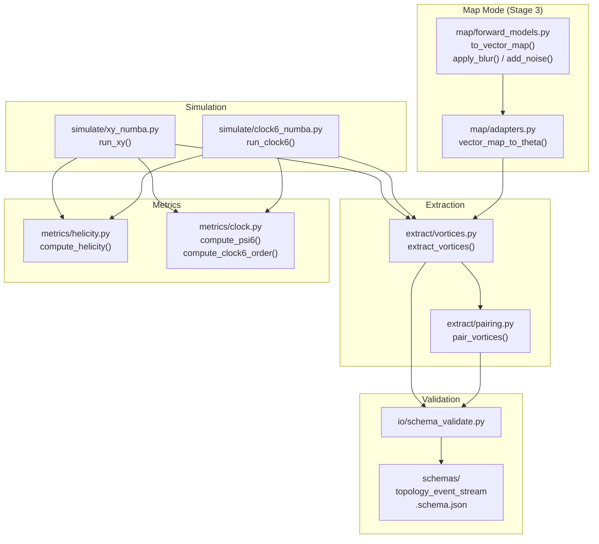

# topostream Development Skill

## 1. Project Identity

**topostream** is a physics research artifact: a topology event stream toolkit for 2D XY and q=6 clock spin models. It extracts vortex / pair / sweep_delta tokens from simulated (and later, adapter-based map-mode) spin fields, with schema validation and reproducibility gates.

**Tech stack:** Python 3.10+, NumPy, SciPy, Numba (jitted MC loops), jsonschema, pytest.

**OS:** Windows (PowerShell). All commands in this repo are run from PowerShell.

---

## 2. Repo Layout

```
topostream_stage0_specs/
├── agents/            # Agent handoff contracts (00–06). LOCKED — never edit.
├── docs/              # Normative specs (SPEC_*.md). LOCKED — never edit.
├── schemas/           # topology_event_stream.schema.json. Edit ONLY for proven gaps (e.g., missing conditionals).
├── configs/           # default.yaml — runtime config for CLI reproduce.
├── src/topostream/
│   ├── simulate/      # xy_numba.py, clock6_numba.py — Numba-jitted Metropolis MC.
│   ├── extract/       # vortices.py, pairing.py — vortex extraction + Hungarian pairing.
│   ├── metrics/       # helicity.py, clock.py — Υ, ψ₆, clock6_order, histograms.
│   ├── map/           # forward_models.py, adapters.py — Stage 3 map-mode groundwork.
│   ├── io/            # schema_validate.py — jsonschema validation helper.
│   └── cli.py         # CLI entrypoint (reproduce, sweep, validate, plot).
├── tests/             # Gate tests — one test file per module + cross-cutting suites.
├── scripts/           # physics_sanity_audit.py — diagnostic runner.
├── results/           # Run outputs (gitignored).
├── Makefile           # reproduce, validate, test, clean targets.
└── pyproject.toml     # Build config, deps, pytest config.
```

---

## 3. Hard Rules (Non-Negotiable)

These rules are codified in `agents/00_repo_rules.md`. Violating ANY of them requires explicit human approval.

### 3.1 Locked Zones
| Path | Rule |
|------|------|
| `docs/` | **NEVER edit.** Normative specs are frozen at Stage 0. |
| `agents/` | **NEVER edit.** Agent contracts are locked. |
| `schemas/` | **Edit ONLY if a test proves a real gap** (e.g., missing conditionals). Requires version bump. |

### 3.2 Physics Rules
- The q=6 clock model has **THREE phases** and **TWO BKT transitions** (T₂ > T₁). Never conflate QLRO with clock-ordered.
- Helicity modulus **Υ(L,T)** is a required metric in every simulation run. Not optional.
- All angle differences use `wrap(Δθ) = arctan2(sin(Δθ), cos(Δθ))`. No other wrapping is permitted.
- Vortex pairing uses **Hungarian min-cost matching** (`scipy.optimize.linear_sum_assignment`) only.
- "Events" are temperature-sweep snapshot deltas, NOT physical time dynamics. Use `token_type="sweep_delta"`.

### 3.3 CPU Rules
- All inner MC loops MUST be **Numba-jitted** (`@numba.njit`). Pure-Python per-spin update loops are forbidden in `src/topostream/simulate/`.
- Job-level parallelism is allowed (one subprocess per seed/temperature).
- Target: L=64 sweep in < 5 minutes on a 4-core laptop.

### 3.4 Schema Rules
- Every output token MUST validate against `schemas/topology_event_stream.schema.json`.
- All provenance fields (`seed`, `L`, `T`, `sweep_index`, `schema_version`) must be populated.
- Schema version bumps require updating ALL emitted token versions, config files, and tests.

### 3.5 Reproducibility Rules
- All seeds must be explicit integers from the list `[42, 43, 44, 45, 46, 47, 48, 49]`.
- One-command reproduce: `python -m topostream.cli reproduce --config configs/default.yaml`
- No hardcoded paths — all paths from config file.
- No `uuid4()` in token IDs — IDs must be deterministic (e.g., `v_p_r004_c004`).

### 3.6 Code Quality Rules
- No `print()` in library code under `src/` — use `logging` module.
- Type hints required on all public functions.
- Every module under `src/topostream/` has a corresponding test file in `tests/`.

---

## 4. Owner's Working Style

### 4.1 Task Structure
The owner gives **highly structured, single-objective task prompts** with:
- A **HARD RULES** section listing what NOT to touch.
- A **TASK** section with exact scope (files to create/modify, function signatures, behavior).
- A **DELIVERABLES** section ending with **STOP** — meaning: deliver exactly what's listed, then stop. Don't add unsolicited extras.

### 4.2 Expectations
- **Read before writing.** The owner expects you to read `agents/00_repo_rules.md` and relevant spec docs BEFORE generating code.
- **Prove, don't claim.** Every deliverable includes runnable proof: `python -m pytest -q` output, git identity, diagnostic snippets.
- **No phantom edits.** Don't modify files the task doesn't authorize. If a test reveals a bug in locked code, REPORT it — don't fix it without explicit approval.
- **Commit atomically.** Each task = one commit with a descriptive message. The owner does `git add .` + `git commit -m "..."` + `git push` after verifying outputs.
- **Baseline tracking.** The owner tracks a baseline test count (e.g., "227 passing"). New tests must ADD to the count, never reduce it. Always report the new total.

### 4.3 Commit Conventions
- Prefix: `chore:`, `feat:`, or descriptive short phrase.
- Branch: `feature/clock6` (or feature branches per major feature).
- Tags: `v0.1-xy-mvp` marks frozen milestones — never touch tagged commits.

### 4.4 Council-Ready Audit Format
The owner periodically requests "re-audit packets" — structured proof bundles intended to be copy/pasted to other LLMs or reviewers. These always include:
1. Git identity (`rev-parse HEAD`, `branch`, `status`).
2. Module existence checks (`ls` / `Test-Path` each source file).
3. Determinism proofs (no `uuid4`, fixed seeds).
4. Full `pytest -q` output.
5. Diagnostic snippets from `scripts/physics_sanity_audit.py`.

---

## 5. Development Patterns

### 5.1 Adding a New Module
1. Create `src/topostream/<subpackage>/<module>.py` with full docstrings.
2. Add `__init__.py` if new subpackage.
3. Create `tests/test_<module>.py` with gate tests.
4. Run `python -m pytest -q` — full suite must pass.
5. If the module emits tokens, ensure they validate against the schema.

### 5.2 Adding a New Metric
1. Add the function to the appropriate `src/topostream/metrics/*.py` file.
2. Do NOT change existing function signatures or behavior.
3. Create dedicated tests in `tests/test_metrics_<name>.py`.
4. Wire the metric into `scripts/physics_sanity_audit.py` as a new column.
5. Verify the metric discriminates temperature (shows different values at T=0.3 vs T=2.0).

### 5.3 Adding a New Simulator
1. Create `src/topostream/simulate/<model>_numba.py`.
2. Public API pattern: `init_config_<model>(L, seed)`, `run_<model>(L, T, J, N_equil, N_meas, N_thin, seed)`.
3. All inner loops must be `@numba.njit`.
4. Return dict with `configs`, `energy_per_spin`, `helicity`, `helicity_err`.
5. Create `tests/test_sim_<model>.py` with physical sanity tests (energy variance, determinism).
6. Wire into `scripts/physics_sanity_audit.py`.

### 5.4 Schema Changes
1. Write a test in `tests/test_schema_conditionals.py` (or new file) that proves the gap.
2. Run the test — confirm it fails.
3. Patch `schemas/topology_event_stream.schema.json`.
4. Bump the `"version"` field in the schema.
5. Update ALL `"schema_version"` strings in: `src/`, `tests/`, `scripts/`, `configs/`.
6. Run full suite — all must pass.

### 5.5 Diagnostic / Audit Scripts
- Scripts live in `scripts/` — they are READ-ONLY consumers of `src/` code.
- They must NEVER modify core simulation code.
- Output format: console table + JSON in `results/diagnostics/`.
- Use `logging.ERROR` level to suppress simulator thermalization warnings.

---

## 6. Testing Conventions

### 6.1 General
- Framework: **pytest** (configured in `pyproject.toml`, `testpaths = ["tests"]`).
- Run: `python -m pytest -q` (always from repo root).
- Naming: `tests/test_<module>.py`, classes `Test<Feature>`, methods `test_<behavior>`.

### 6.2 Fast Parameters
- Tests use SHORT MC parameters for speed: `N_equil=200`, `N_meas=500`, `N_thin=50`.
- Never use production-scale parameters in tests (those go in `configs/default.yaml`).

### 6.3 Determinism
- All tests use explicit seeds (typically `seed=42`).
- Determinism tests: run the same function twice and assert bitwise equality (use `np.array_equal(a, b, equal_nan=True)` for arrays that may contain NaN).

### 6.4 Physical Assertions
- Use **weak, robust assertions** for physics tests — tolerances, not exact values.
- Issue **warnings** (not failures) for known model behaviors (e.g., Clock6 trapping at low T).
- Use `pytest.warns(UserWarning)` for expected warning paths.

### 6.5 Schema Validation in Tests
- Use `topostream.io.schema_validate.validate_token(token)` — it raises on invalid tokens.
- Positive controls: valid tokens must pass without error.
- Negative controls: invalid tokens must raise with `pytest.raises(Exception)`.

---

## 7. Key Commands

```powershell
# Run all tests
python -m pytest -q

# Run single test file
python -m pytest -q tests/test_sim_xy.py

# Run diagnostics
python scripts/physics_sanity_audit.py

# Full reproduce pipeline
python -m topostream.cli reproduce --config configs/default.yaml

# Git identity audit
git rev-parse HEAD; git branch --show-current; git status --short

# Search for version strings
Get-ChildItem -Recurse -Include *.py src,tests,scripts | Select-String -Pattern '"1.1.0"'
```

---

## 8. Known Gotchas

| Issue | Impact | Workaround |
|-------|--------|------------|
| Clock6 metastability at low T | Random init can trap in antiferromagnetic states → positive energy | Use energy variance / config diversity tests, not raw energy ordering |
| `\|ψ₆\|` ≡ 1.0 for Clock6 | The sixfold order parameter is always 1.0 for discrete clock configs | Use `compute_clock6_order()` (max population fraction) instead |
| Metropolis sign convention | Both XY and Clock6 appear to accept uphill moves — existing tests pass anyway | Do NOT "fix" without explicit owner approval + new test proving the bug |
| PowerShell stderr handling | Python logging warnings on stderr cause PowerShell to report exit code 1 | Set logging to `ERROR` in scripts, or redirect with `2>$null` |
| NaN propagation in map-mode | A single NaN site affects up to 4 vortex plaquettes | Document, don't suppress. Use `nanmean` in downsampling, weight-normalization in blur |
| `np.array_equal` with NaN | `NaN != NaN` by IEEE → determinism tests fail | Use `np.array_equal(a, b, equal_nan=True)` |

---

## 9. Architecture Diagram


